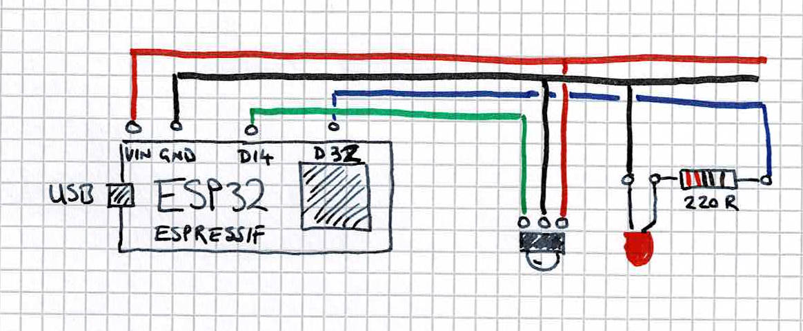
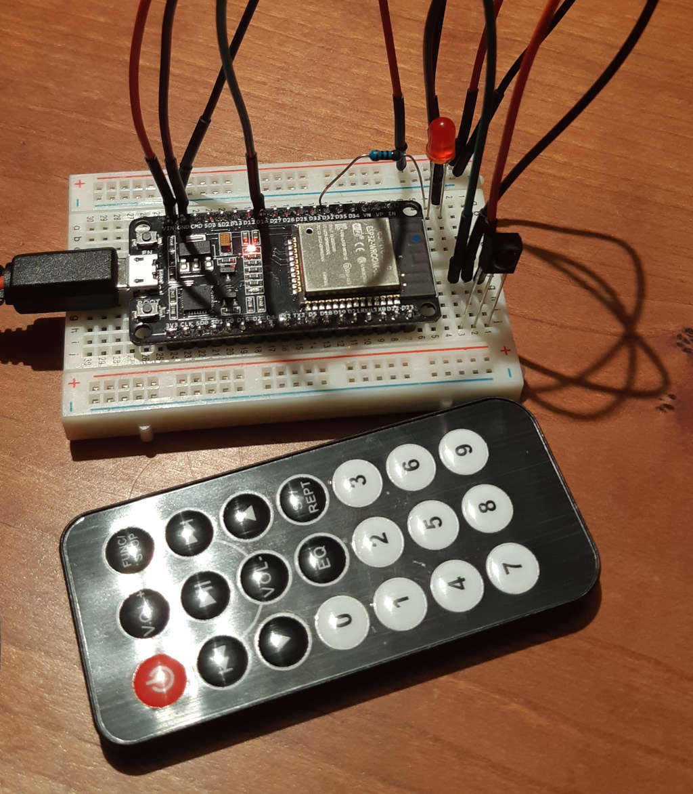

# Arduino ESP32 mood controller

This project sends an commands to an [MQTT broker](http://mqtt.org/). It's part of a mood barometer project found here https://github.com/neilspink/mood-barometer

## Components

* NodeMCU-32S ESP32 WiFi Bluetooth development board
* IR Reciever
* 10K Resistor + LED
* Mini IR Remote Controller

## Remote Control

The remote control sends commands to buttons 1 to 5 send. The up and down buttons sends a single vote.